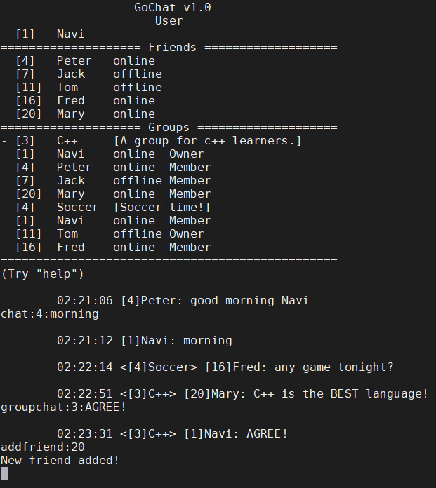

# GoChat
>A chat server and client based on muduo network library, able to work in Nginx TCP load balancing environment



## Features
* Log in & Sign up
* One-to-one chat
* Group chat
* Add friends
* Create/add groups
* Offline message

## Dependencies
### [muduo](https://github.com/chenshuo/muduo)
A multithreaded C++ network library based on the reactor pattern.

### [boost](https://www.boost.org/)
Required by muduo (for boost::any only). Version 1.69.0.

### MySQL
Version 8.0.

### Nginx
Version 1.12.2.

## Build
```
./build.sh
```
## Run
### Server
```
./bin/gochat-server
```
### Client
```
./bin/gochat-client [IP] [Port]
```
On localhost:
```
./bin/gochat-client 127.0.0.1 8888
```